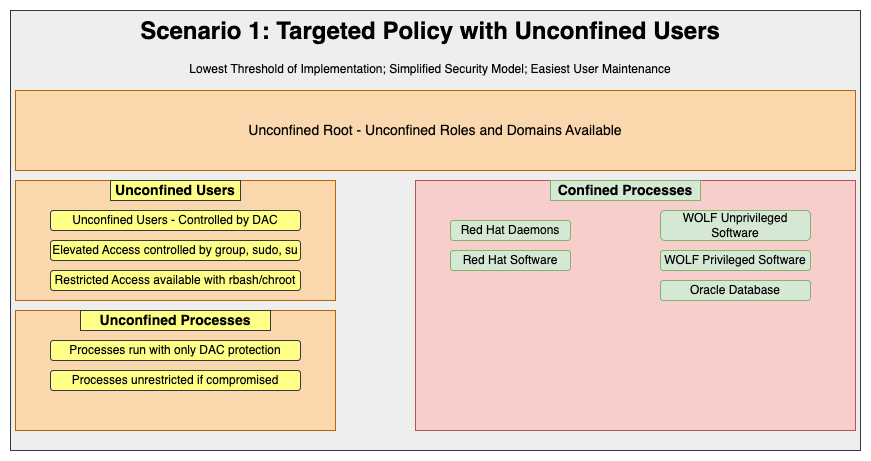
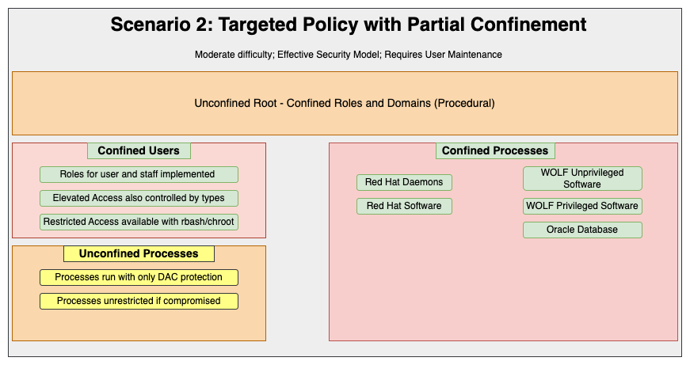
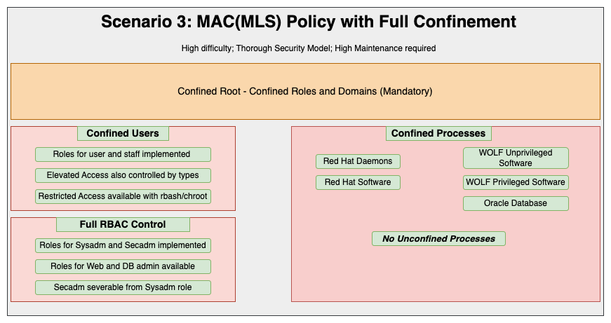
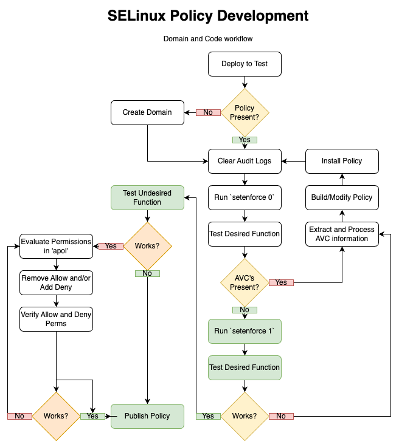

Analysis of the WOLF system began with an extensive review of system documentation available on the customer network, review of code structure and in-use capabilities, and a thorough review of the existing/available System Security Plan (SSP) documentation. Major system functions reliant on Solaris zones were discussed with Lockheed personnel to ascertain their purpose, crucial details about their function, and the architecture of the newly implemented system. Additionally, Solaris Privileges in use by the existing code were cross-referenced to the corresponding Linux Capabilities. These capabilities in many circumstances are directly managed by SELinux security policy and offered insight to the overall behavior of the system.

The following observations and recommendations represent reasonable prudence to balance information systems security with long-term maintainability of security policy. It represents a centerline solution that provides confinement and isolation of customer code from system processes and establishes control over their interactions.  

= Security Policy review

Review of the SSP for the WOLF system was performed after developing an understanding of the function of the system and its diverse use cases. The SSP was based on layered guidance from NIST 800-53, DOD STIG, and NSA Common Criteria control overlays governing access, authentication, audit, data confidentiality, and compliance controls in a Multi-Level Security(MLS) system built on Solaris.

The redesign of the system involves several changes to the fundamental technologies involved including security capabilities, operating system compliance, and architecture of the overall WOLF system:

* Solaris 10 being replaced with RHEL 9
* Zones are being eliminated
* MLS systems are being flattened into two (or more) single-level systems 
* Previous MLS capabilities replaced by a CDS system
* NIST 800-53 has been updated to Rev 5
* STIG for RHEL 9 replacing any Solaris guidance

The implications of these changes stretch beyond the scope of SELinux policy implementation. However, a fundamental understanding of how those changes affect the required posture of the system has direct bearing on the actual implementation of a security policy as embodied in SELinux. 

A one-to-one effort implementing all security controls presently required by the Solaris-based SSP in a full MAC system is a very large undertaking that appears to add unnecessary complexity to the system.

== Recommendation

Continue to pursue the clean reevaluation of the system requirements from Josh Demenge in CRE. Design the SELinux policy based upon the results of that effort.  

= Policy Structure

We discussed three variations of policy structure in the demo given on 3/25/2025. Each of these structures can be used either as an endpoint by itself or as a roadmap from one state to the next. Proper selection of the structure is contingent on the results of the policy review mentioned previously.

== Minimal implementation of Targeted Policy

This minimalist SELinux policy implementation is effectively the starting point of policy building effort. It starts with the standard set of confined domains within the Linux operating system, and extends the existing policy with new confined domains for the WOLF software suite. The unconfined user and unconfined daemon domains remain present on the system and allow users to access all pieces of software running on the system that are not otherwise confined by discretionary access controls (DAC), RBAC, extended attributes, or other security mechanisms such as chroot and rbash.

This looser structure lends itself well to initial development and a broader set of policy scopes then what would otherwise be considered in stricter policies. One could, though it is not recommended, define a single policy domain called WOLF and put all transition rules inside the policy. The drawback of the approach is that it becomes hard to define transition rules that make sense later on down the road when building a stricter implementation of SELinux. 

At this stage, it makes much more sense to define broad categories of activity defined in the system and build policies around those categories. For example vehicle access control, personnel actions, depot level maintenance, reports, parts, ordering, etc may or may not be performed by any number of groups from 1 to n.  

Further, defining what software requires elevated access, cordoned access, or commonly accessible function across the portfolio can aid in not only future security and auditing efforts, but allow you to break up the policy modules into smaller more manageable pieces that can be understood at a glance and tested with minimal effect to adjacent policy elements.

Bearing in mind that ALL files are in scope for SELinux, it's also important plan and map the directory structure of the application and using a combination of regular expression and direct file/executable path, declare file contexts that group file and directory by logical function. 

A spreadsheet with binary, dependencies, elevated, user groups (by job type), functional grouping (by activity type), and work location (hangar, wing, depot, etc) can be invaluable in determining realistic policy groups. If another grouping makes sense, don't be afraid to use it. This becomes the foundation for User enforcement. 

The primary goal of this is to have all software grouped into relevant domains and tested to be functional. The next step, if SSP dictates, is to confine the users on the system by assigning Login users to SELinux users, which we will cover in the next section.

<<<
== Targeted policy with MAC-enforced Users

This variation of policy builds on the previous work and begins to bucket users into selinux users. An SELinux user can be thought of similar to a role in that multiple linux users can be assigned to one SELinux user. The functional difference between an SELinux user and and SELinux role is that roles exist primarily to govern how a user interacts with the system and what capabilities they have, where the selinux user allows more granular filtration of permissions. 

For example, roles exist for user_r (no sudo, no su), staff_r (sudo, no su), and sysadm_r (sudo, su). By default, a user_u is bound to user_r, and the same goes for staff_u:staff_r and sysadm_u:sysadm_r. In a single-function system, these SELinux users may suffice for confinement. This, in most cases, is sufficient confinement for users and provides suitable protection against insider threats. 

<<<
== MAC Policy without Unconfined domains

This third variation of policy is quite easily the most difficult to maintain, but is also the most secure implementation of SELinux. It is achieved by enabling and installing the MLS policy. In doing so, both the unconfined user capability and the unconfined types are removed from the system. In this state, all processes and all users must have a valid context before access is granted to any system resource. Any custom software packages must have a valid confined domain. All access to system resources, by software or by users, is governed by explicit grant.
All access to system resources, by software or by users, is governed by explicit grant. 

This state is the closest analog to the current implementation under trusted Solaris. It does enable the ability to use MLS as well, but MAC and the removal of Unconfined would be the chief goals in the WOLF implementation.

== Recommendation

In the interest of balancing security with software/program maintainability, I recommend scenario #2, Targeted policy, and judicious use of confined users if the SSP requires it. Until that advice is formalized, the planning and initial implementation as discussed under scenario #1 is pursuable as either an interim or a final implementation, depending on the complexity inherent in the revised system security plan. That being said, if confined users are not required in the revisited security plan, I recommend scenario #1.

= Users and User confinement

== Users

On larger systems with multiple software roles and functions, you can create additional users with a unique name and assign additional permissions to that unique user. For example, by creating a maintenance_u, assigning a Linux user to it, and granting access via type permissions to depot_software_t you can grant that SELinux user access to order parts without granting any other user_u member permission. By assigning that SELinux maintenance_u user to the user_r role, it helps simplifying the creation all the associated login permissions etc.

The process to do so involves creation of a user module and applying that module prior to adding users and transitions dependent on that user id. For that reason I generally advise against custom users without a solid, clearly defined purpose for that custom user to exist... and clearly defined limits as to which explicit use cases require it. 

== Roles

SELinux has a few built-in roles which, in a MAC-based implementation, can be assigned to and accessed by a combination of direct login (user_r attached to user_u; sysadm_r attached to sysadm_u, staff_r to staff_u) and roles which are accessed by a role transition governed by a combination of sudo permissions and the newrole command. basic system user with no 

Section 3.2 of the https://docs.redhat.com/en/documentation/red_hat_enterprise_linux/9/html/using_selinux/managing-confined-and-unconfined-users_using-selinux#roles-and-access-rights-of-selinux-users_managing-confined-and-unconfined-users[roles-and-access-rights-of-selinux-users] shows the role mapping and limitations of each user and role type as shipped by default in the policy. Please note you must expand table 3.2 to see the full map.

While the creation of custom roles is possible, it is prohibitively difficult to do so and get right without extensive planning and significant amounts of iterative testing, and in most cases is 100% unnecessary. The extreme edge case of building a custom role and binding it to a custom user is almost impossible to test due to the quantity of permissions required to make even a simple command line login to a system. While some build tools do exist for generalize login classes (unprivileged and privileged) the overhead to build, install, and maintain them is a massive undertaking and a completely custom policy.  

== Recommendation

Avoid creating customer users unless absolutely necessary. Do not create custom roles. If user confinement is required use user_ud and staff_u as the login roles for all but systems administrators. 

<<<

= Policy Development and Testing

The key point to remember about developing and testing SELinux policy is to be deliberate and methodical with respect to capture AVC's in a clean environment, validating the need for explicit transitions and access types, and testing the rules in an enforcing environment prior to performing any exploitive testing. Such testing can and should create a number of denials that you do not want to incorporate into a policy and it can be difficult and time consuming to wade through entries in a "dirty" environment. 

My general recommendation is to stop auditd, rotate or delete audit logs, and restart auditd prior to commencing testing. When you have a clean slate from which to begin, capturing rules using audit2allow and audit2why from which to build a policy is a much cleaner and more discrete method to build a policy. It can be, in a dev environment, as simple as:

[source,bash]
---
service auditd stop
cat /dev/null > /var/log/audit/audit.log
service auditd start
---

When creating a policy, start with the sepolicy generate to get the stub entries for the interface, type enforcement, and file context files (.if, .te, and .fc respectively.) Part of the process installs a tool in the policy folder that will update rules and rebuild policy into a portable policy (.pp) module.

The 'sepolicy generate' command can create stub modules for all of the following:

[source,bash]
---
Policy types which require a command:
  --application         Generate 'User Application' policy
  --cgi                 Generate 'Web Application/Script (CGI)' policy
  --dbus                Generate 'DBUS System Daemon' policy
  --inetd               Generate 'Internet Services Daemon' policy
  --init                Generate 'Standard Init Daemon' policy
Policy types which do not require a command:
  --admin_user          Generate 'Administrator Login User Role' policy
  --confined_admin      Generate 'Confined Root Administrator Role' policy
  --customize           Generate 'Existing Domain Type' policy
  --desktop_user        Generate 'Desktop Login User Role' policy
  --newtype             Generate 'Module information for a new type' policy
  --sandbox             Generate 'Sandbox' policy
  --term_user           Generate 'Minimal Terminal Login User Role' policy
  --x_user              Generate 'Minimal X Windows Login User Role' policy
---

Arguments provided to the command can precreate transitions from pre-existing selinux users and roles to the new domain and reduce workload. 'sepolicy generate --help' provides guidance.

In this example, I've created a policy for an application called random_app"
[source,bash]
---
$ sepolicy generate --application random_app -n random_app
***************************************
Warning /home/msalowit/workspace/random_app does not exist
***************************************
Created the following files:
/home/msalowit/workspace/random_app.te # Type Enforcement file
/home/msalowit/workspace/random_app.if # Interface file
/home/msalowit/workspace/random_app.fc # File Contexts file
/home/msalowit/workspace/random_app_selinux.spec # Spec file
/home/msalowit/workspace/random_app.sh # Setup Script
---

The shell script random_app.sh can be used to build and install policy. One note, inside the .te file is a line automatically created the at places the individual domain into permissive mode. This line will need to be removed in order to do enforcing tests.

[source,random_app.te]
---
permissive random_app_t;
---

Catching and parsing AVC's over multiple iterations can be simplified somewhat using some basic shell commands. Included in the module directory is a named script, in this case random_app.sh. Running this script as root with no flags will grab AVC's out of the audit logs and parse them for addition to the policy. Running it with the --update flag will prompt for confirmation and then add the new AVC's to the policy and rebuild the module.

At this first stage, add the file and directory paths to the file contexts and build/rebuild the module. 

[source,bash]
---
[msalowit@selinux-testing random_app]$ sudo ./random_app.sh
Building and Loading Policy
+ make -f /usr/share/selinux/devel/Makefile random_app.pp
Compiling mls random_app module
Creating mls random_app.pp policy package
rm tmp/random_app.mod.fc tmp/random_app.mod
+ /usr/sbin/semodule -i random_app.pp
+ sepolicy manpage -p . -d random_app_t
Traceback (most recent call last):
  File "/bin/sepolicy", line 684, in <module>
    args.func(args)
  File "/bin/sepolicy", line 344, in manpage
    m = ManPage(domain, path, args.root, args.source_files, args.web)
  File "/usr/lib/python3.6/site-packages/sepolicy/manpage.py", line 402, in __init__
    self.mcs_constrained_types = _gen_mcs_constrained_types()
  File "/usr/lib/python3.6/site-packages/sepolicy/manpage.py", line 150, in _gen_mcs_constrained_types
    mcs_constrained_types = next(sepolicy.info(sepolicy.ATTRIBUTE, "mcs_constrained_type"))
StopIteration
---

It's safe to disregard the errors here, they are related to man page creating for the module. The output of this is random_app.pp and the module is installed. `sudo ./random_app.sh --update` to check for changes and add, and subsequent build runs are performed without the --update argument.

Once the module is installed, relabel the files with `restorecon -rv` before continuing.

Policy review is done at this stage. Once the "final" portable policy (.pp) is created, it can be installed as follows:

[source,bash]
---
$ sudo semodule -i -X 400 random_app.pp
---

I explicitly set pri 400 because this is the default for user created modules. Establishing this positively during the module installation will help in the management of those policies below.

<<<
= Policy Management and Distribution

Each .pp module loaded takes anywhere from 3-10 seconds to load and, once loaded, can be hard to review, and more importantly, harder to enforce specific line items in policy. If you have a number of modules, this can add significant time overhead to provisioning systems. In addition, compliance review for policy can only be done through a comparison of running policy to published policy. One answer to both of these issues to convert the .pp modules into Compiler Intermediary Language(.cil) files. The .cil files offer three main benefits:

* easier to read, compare, and maintain
* much faster installation (tenfold or better speed installing a module)
* not a binary object in source control

The initial conversion to cil is quite easy. To convert my random_app.pp:

[source,bash]
---
$ /usr/libexec/selinux/hll/pp random_app.pp > random_app.cil
---

The output cil file contains the list of machine directives in the format you can compare against loaded policy:

[source,bash]
---
[root@selinux-testing random_app]# /usr/libexec/selinux/hll/pp random_app.pp
(roleattribute random_app_roles)
(roleattributeset random_app_roles (system_r ))
(roletype random_app_roles random_app_t)
(type random_app_t)
(roletype object_r random_app_t)
(typepermissive random_app_t)
(type random_app_exec_t)
(roletype object_r random_app_exec_t)
(roleattributeset cil_gen_require system_r)
(typeattributeset cil_gen_require application_domain_type)
(typeattributeset application_domain_type (random_app_t ))
(typeattributeset cil_gen_require domain)
(typeattributeset domain (random_app_t ))
(typeattributeset cil_gen_require corenet_unlabeled_type)
(typeattributeset corenet_unlabeled_type (random_app_t ))
(typeattributeset cil_gen_require application_exec_type)
(typeattributeset application_exec_type (random_app_exec_t ))
(typeattributeset cil_gen_require exec_type)
(typeattributeset exec_type (random_app_exec_t ))
(typeattributeset cil_gen_require file_type)
(typeattributeset file_type (random_app_exec_t ))
(typeattributeset cil_gen_require non_security_file_type)
(typeattributeset non_security_file_type (random_app_exec_t ))
(typeattributeset cil_gen_require non_auth_file_type)
(typeattributeset non_auth_file_type (random_app_exec_t ))
(typeattributeset cil_gen_require entry_type)
(typeattributeset entry_type (random_app_exec_t ))
(typeattributeset cil_gen_require privfd)
(typeattributeset cil_gen_require etc_t)
(typeattributeset cil_gen_require etc_runtime_t)
(typeattributeset cil_gen_require locale_t)
(typeattributeset cil_gen_require usr_t)
(allow random_app_t random_app_exec_t (file (entrypoint)))
(allow random_app_t random_app_exec_t (file (ioctl read getattr lock map execute open)))
(allow random_app_t self (fifo_file (ioctl read write create getattr setattr lock append unlink link rename open)))
(allow random_app_t self (unix_stream_socket (ioctl read write create getattr setattr lock append bind connect listen accept getopt setopt shutdown)))
(allow random_app_t privfd (fd (use)))
(allow random_app_t etc_t (dir (ioctl read getattr lock search open)))
(allow random_app_t etc_t (dir (getattr search open)))
(allow random_app_t etc_t (file (ioctl read getattr lock open)))
(allow random_app_t etc_t (dir (getattr search open)))
(allow random_app_t etc_t (lnk_file (read getattr)))
(allow random_app_t etc_t (dir (ioctl read getattr lock search open)))
(allow random_app_t etc_t (dir (getattr search open)))
(allow random_app_t etc_runtime_t (file (ioctl read getattr lock open)))
(allow random_app_t etc_t (dir (getattr search open)))
(allow random_app_t etc_runtime_t (lnk_file (read getattr)))
(allow random_app_t etc_t (dir (getattr search open)))
(allow random_app_t etc_t (lnk_file (read getattr)))
(allow random_app_t usr_t (dir (getattr search open)))
(allow random_app_t locale_t (dir (ioctl read getattr lock search open)))
(allow random_app_t locale_t (dir (getattr search open)))
(allow random_app_t locale_t (file (ioctl read getattr lock open)))
(allow random_app_t locale_t (dir (getattr search open)))
(allow random_app_t locale_t (lnk_file (read getattr)))
(allow random_app_t locale_t (file (map)))
(filecon "/home/msalowit/workspace/random_app" file (system_u object_r random_app_exec_t ((s0) (s0))))
---

The running policy can be found under the approriate policy in /var/lib/selinux. From my running MLS system:

[source,bash]
---
[root]# ls /var/lib/selinux/mls/active/modules/
100  400  disabled
[root]# ls /var/lib/selinux/mls/active/modules/400
ibis  random_app  tomcat
[root]# ls /var/lib/selinux/mls/active/modules/400/random_app/
cil  hll  lang_ext
---

Using and specifying the 400 module priority gives you a clean, commonly used place to place custom modules and directly declaring it gives you confidence that they will be there when you look. By checking the 400 directory, you can get an easy list of what modules are in fact installed. 

In order to check the contents of the running module, we read the cil entry using bzcat:

[source,bash]
---
[root]# bzcat /var/lib/selinux/mls/active/modules/400/random_app/cil
(roleattribute random_app_roles)
(roleattributeset random_app_roles (system_r ))
(roletype random_app_roles random_app_t)
(type random_app_t)
(roletype object_r random_app_t)
(typepermissive random_app_t)
(type random_app_exec_t)
(roletype object_r random_app_exec_t)
(roleattributeset cil_gen_require system_r)
(typeattributeset cil_gen_require application_domain_type)
(typeattributeset application_domain_type (random_app_t ))
(typeattributeset cil_gen_require domain)
(typeattributeset domain (random_app_t ))
(typeattributeset cil_gen_require corenet_unlabeled_type)
(typeattributeset corenet_unlabeled_type (random_app_t ))
(typeattributeset cil_gen_require application_exec_type)
(typeattributeset application_exec_type (random_app_exec_t ))
(typeattributeset cil_gen_require exec_type)
(typeattributeset exec_type (random_app_exec_t ))
(typeattributeset cil_gen_require file_type)
(typeattributeset file_type (random_app_exec_t ))
(typeattributeset cil_gen_require non_security_file_type)
(typeattributeset non_security_file_type (random_app_exec_t ))
(typeattributeset cil_gen_require non_auth_file_type)
(typeattributeset non_auth_file_type (random_app_exec_t ))
(typeattributeset cil_gen_require entry_type)
(typeattributeset entry_type (random_app_exec_t ))
(typeattributeset cil_gen_require privfd)
(typeattributeset cil_gen_require etc_t)
(typeattributeset cil_gen_require etc_runtime_t)
(typeattributeset cil_gen_require locale_t)
(typeattributeset cil_gen_require usr_t)
(allow random_app_t random_app_exec_t (file (entrypoint)))
(allow random_app_t random_app_exec_t (file (ioctl read getattr lock map execute open)))
(allow random_app_t self (fifo_file (ioctl read write create getattr setattr lock append unlink link rename open)))
(allow random_app_t self (unix_stream_socket (ioctl read write create getattr setattr lock append bind connect listen accept getopt setopt shutdown)))
(allow random_app_t privfd (fd (use)))
(allow random_app_t etc_t (dir (ioctl read getattr lock search open)))
(allow random_app_t etc_t (dir (getattr search open)))
(allow random_app_t etc_t (file (ioctl read getattr lock open)))
(allow random_app_t etc_t (dir (getattr search open)))
(allow random_app_t etc_t (lnk_file (read getattr)))
(allow random_app_t etc_t (dir (ioctl read getattr lock search open)))
(allow random_app_t etc_t (dir (getattr search open)))
(allow random_app_t etc_runtime_t (file (ioctl read getattr lock open)))
(allow random_app_t etc_t (dir (getattr search open)))
(allow random_app_t etc_runtime_t (lnk_file (read getattr)))
(allow random_app_t etc_t (dir (getattr search open)))
(allow random_app_t etc_t (lnk_file (read getattr)))
(allow random_app_t usr_t (dir (getattr search open)))
(allow random_app_t locale_t (dir (ioctl read getattr lock search open)))
(allow random_app_t locale_t (dir (getattr search open)))
(allow random_app_t locale_t (file (ioctl read getattr lock open)))
(allow random_app_t locale_t (dir (getattr search open)))
(allow random_app_t locale_t (lnk_file (read getattr)))
(allow random_app_t locale_t (file (map)))
(filecon "/home/msalowit/workspace/random_app" file (system_u object_r random_app_exec_t ((s0) (s0))))
[root]# 
---

A simple block compare between the 400/{module}/cil and the .cil file in source control can determine if the policy is correct and can be automated in a number of ways. The semodule command can take the .cil directly as an argument:

[source,bash]
---
$ sudo semodule -i -X 400 random_app.cil
---

Congratulations, you can now audit and remediate a running system to a published policy! 

= Additional Considerations

* When switching back and forth between MLS and Targeted (or other policy) modules and booleans need to be checked and reconfigured.
* If switching to MLS, set policy to permissive, relabel on boot, then enforce.
* Enforce FIPS before enforcing MLS. It's easier to change crypto policy before applying MAC as the permissions required cross both sysadm and secadm roles.

= References

RHEL9 SELinux Manual: https://docs.redhat.com/en/documentation/red_hat_enterprise_linux/9/html/using_selinux/index[Using SELinux]

